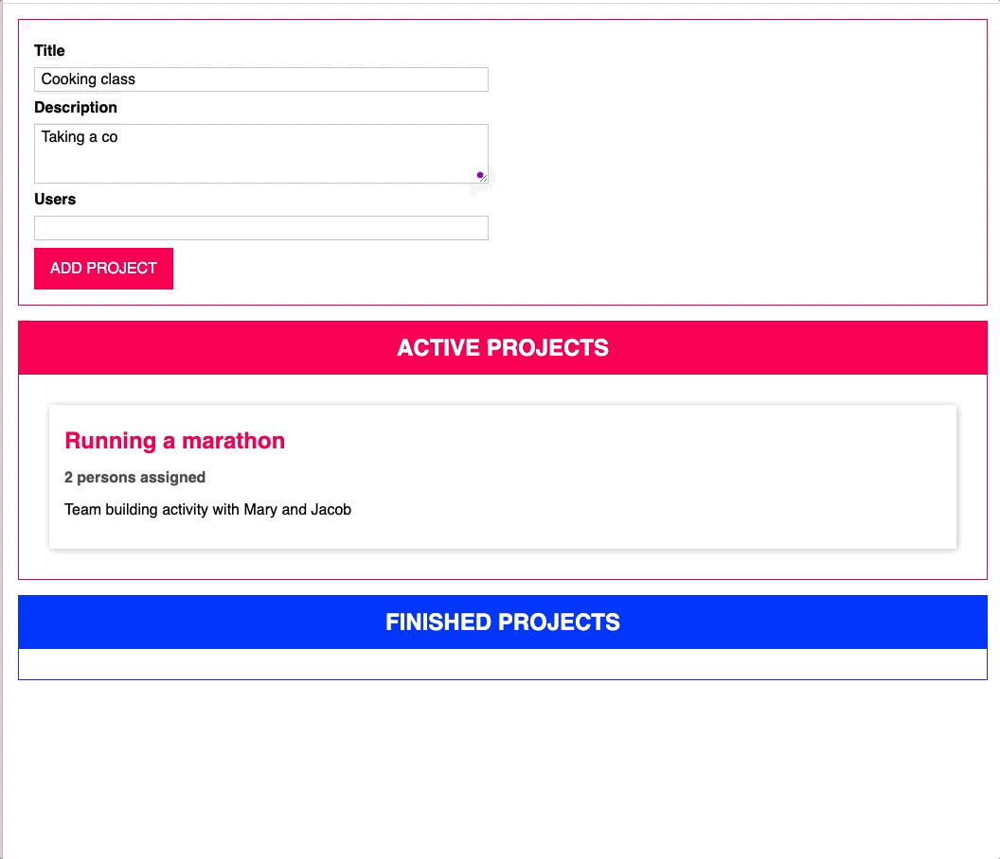

# Drag and Drop Project with Typescript

This is a simple project where you can drag and drop elements around the screen. It was created to learn Typescript. The following features are implemented using an OOP approach:

- The project is not split into multiple files, but all the code is in one file.
- It uses a couple of classes to represent the project.
- Within the project I was able to use:
  - Interfaces
  - Enums
  - Type Aliases
  - Abstract Classes
  - Auto-Binding

## My Learnings

- Using Typescript with classes in and OOP approach has a lot of advantages. It makes the code more readable and easier to maintain. At the moment I am not sure if it is worth the effort to use Typescript in a small project like this, but I am sure that it will be worth it in bigger projects even though the learning curve is a bit steep is worth it.
- A good way learning TS in an OOP using interfaces, enums, type aliases, abstract classes and auto-binding when manipulating the DOM.

### Screenshots

## Improvements

- The project is not split into multiple files, but all the code is in one file. This is not a good practice and should be changed.
- The UI styling is not very good. It should be improved for desktop and mobile.
- Saving the state of the project in the local storage would be a nice feature or to an API.

### Built with

- HTML
- Typescript
- CSS

### Links

- Solution URL: [solution](https://github.com/e-rojas/drag-and-drop-ts)
- Live Site URL: [live site URL](https://e-rojas.github.io/Product-Preview-Card/)
